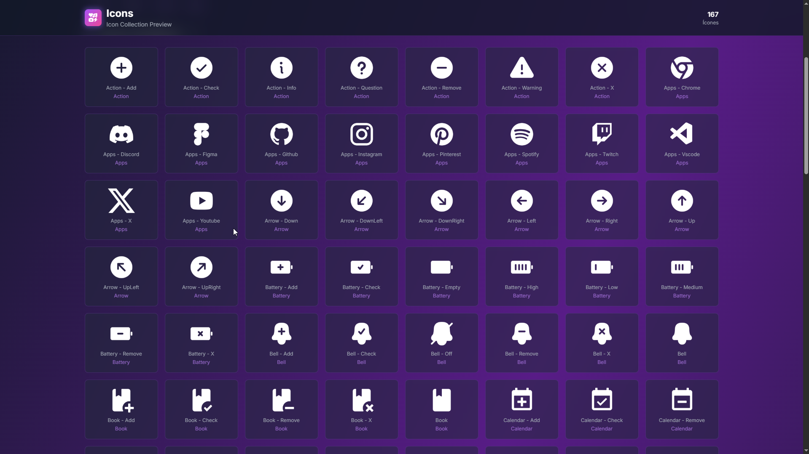
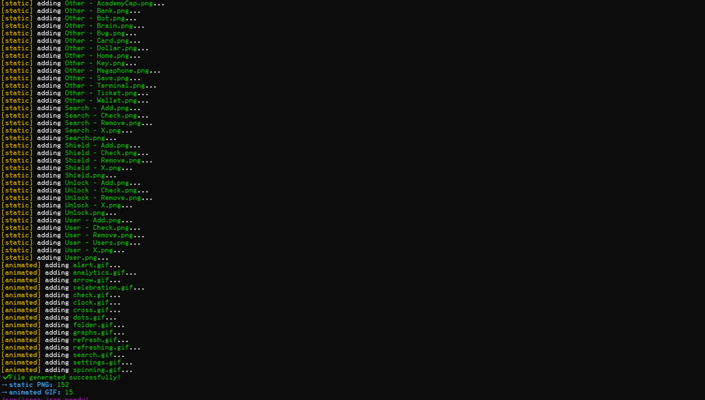

# 🎨 Icons Collection

<div align="center">


Coleção de ícones **PNG** e **GIF**, organizados para interfaces, dashboards e projetos web.

Inclui uma **CLI minimalista**, **página web de preview** e **API REST** para navegação, listagem e busca.

</div>

---

> [!NOTE]
> A coleção completa está em `/static`, `/animated` e também acessível via CLI, página web e API.

---

## 🌐 Página Web de Preview

Interface web moderna e interativa para visualizar todos os ícones da coleção.

<div align="center">
  


*Interface web com busca, filtros e visualização de ícones*

</div>

### ✨ Funcionalidades

- 🔍 **Busca em tempo real** - Pesquise ícones por nome ou categoria
- 🎨 **Filtros** - Filtre por tipo (Estáticos, Animados ou Todos)
- 📱 **Responsivo** - Funciona perfeitamente em desktop, tablet e mobile
- 🎯 **Modal interativo** - Clique em qualquer ícone para ver detalhes
- 📋 **Copiar caminho** - Copie o caminho do ícone com um clique
- ⬇️ **Download** - Baixe ícones diretamente da interface
- 🏷️ **Navegação por categorias** - Badges clicáveis para navegar rapidamente
- 📊 **Contador dinâmico** - Veja quantos ícones estão sendo exibidos

### 🚀 Como Usar

#### Opção 1: Servidor Local (Recomendado)

1. **Instale as dependências:**
   ```bash
   npm install
   ```

2. **Inicie o servidor:**
   ```bash
   npm start
   ```

3. **Acesse no navegador:**
   ```
   http://localhost:3000
   ```

#### Opção 2: Abrir Diretamente

Abra o arquivo `public/index.html` diretamente no navegador (algumas funcionalidades podem não funcionar sem servidor).

### 🎨 Tecnologias Utilizadas

- **TailwindCSS** (via CDN) - Estilização moderna e responsiva
- **Font Awesome** - Ícones da interface
- **JavaScript Vanilla** - Lógica e interatividade
- **Express.js** - Servidor e API REST

### 📡 API REST

O servidor também expõe uma API REST para acessar os ícones:

```bash
# Obter lista de todos os ícones
GET http://localhost:3000/api/icons

# Resposta:
{
  "static": {
    "Action": ["Action - Add.png", "Action - Check.png", ...],
    "Apps": ["Apps - Chrome.png", "Apps - Discord.png", ...],
    ...
  },
  "animated": ["alert.gif", "analytics.gif", ...]
}
```

### 🎯 Recursos da Interface

#### Busca e Filtros
- Digite na barra de busca para filtrar ícones em tempo real
- Use os botões de filtro para mostrar apenas estáticos, animados ou todos
- A busca funciona tanto no nome do ícone quanto na categoria

#### Modal de Detalhes
- Clique em qualquer ícone para abrir o modal
- Visualize o ícone em tamanho maior
- Copie o caminho completo do arquivo
- Baixe o ícone diretamente
- Pressione `ESC` para fechar

#### Navegação
- Use os badges de categorias para navegar rapidamente
- O contador no header mostra quantos ícones estão visíveis
- Layout em grid responsivo que se adapta ao tamanho da tela

---

## 🖥️ CLI — Icons Command Line Tool

Interface simples para navegar, listar e buscar ícones direto do terminal.

<div align="center">
  


*Ferramenta de linha de comando para gerenciar ícones*

</div>

> [!IMPORTANT]
> A CLI ainda **não foi publicada no npm**.
> Pode ser usada localmente via `npx` ou `npm link`.

### 📦 Estrutura da CLI

```
cli/
 └ src/
    ├ bin/icons.ts          # Ponto de entrada
    ├ commands/             # Comandos disponíveis
    │   ├ help.ts          # Ajuda
    │   ├ list.ts          # Listar ícones
    │   └ search.ts         # Buscar ícones
    ├ utils/                # Utilitários
    │   ├ fileScanner.ts   # Escanear arquivos
    │   └ paths.ts         # Resolver caminhos
    ├ types.ts              # Tipos TypeScript
    └ index.ts              # Índice principal
```

### 🚀 Como Usar (Local)

#### Via npx (sem instalar)

```bash
npx ts-node ./cli/src/bin/icons.ts
```

#### Via link global

```bash
cd cli
npm install
npm link
icons
```

> [!TIP]
> Depois do `npm link`, o comando `icons` funciona globalmente no sistema.

### 📚 Comandos Disponíveis

```bash

icons --help


icons list

icons list Action
icons list Apps


icons search check
icons search chrome


icons search check --full
```

> [!NOTE]
> Tudo foi pensado pra ser curto, rápido e direto.

### 🔧 Desenvolvimento da CLI

```bash

cd cli
npm install


npm run build


npm start
```

---

## 📝 Scripts Utilitários

### Gerar JSON de Ícones

O script `scripts/generate-json.sh` gera automaticamente o arquivo `Json/icons.json` com todos os ícones do projeto.

```bash
# Executar o script
bash scripts/generate-json.sh
```


O script:
- Escaneia todas as pastas em `/static`
- Coleta todos os arquivos `.png`
- Escaneia a pasta `/animated` para arquivos `.gif`
- Gera um JSON estruturado em `Json/icons.json`
- Mostra um spinner animado durante o processo
- Exibe estatísticas ao final

**Formato do JSON gerado:**
```json
{
  "static": {
    "Action": [
      "static/Action/Action - Add.png",
      "static/Action/Action - Check.png",
      ...
    ],
    "Apps": [
      "static/Apps/Apps - Chrome.png",
      ...
    ]
  },
  "animated": [
    "animated/alert.gif",
    "animated/analytics.gif",
    ...
  ]
}
```

---

## 🧩 Uso no Projeto

### HTML

```html
<!-- Ícone estático -->


<!-- Ícone animado -->

```

### CSS

```css
.icon {
  width: 32px;
  height: 32px;
  background: url('path/to/icon.png') center no-repeat;
  background-size: contain;
}
```

### JavaScript (com API)

```javascript
// Buscar lista de ícones
fetch('http://localhost:3000/api/icons')
  .then(res => res.json())
  .then(data => {
    console.log('Ícones estáticos:', data.static);
    console.log('Ícones animados:', data.animated);
  });
```

### React/Next.js

```jsx
// Componente de ícone
function Icon({ category, name, type = 'static' }) {
  const path = type === 'static' 
    ? `/static/${category}/${name}.png`
    : `/animated/${name}.gif`;
    
  return ;
}

// Uso
<Icon category="Action" name="Action - Check" />
<Icon name="loading" type="animated" />
```

---

## 🧠 Dicas e Boas Práticas

> [!TIP]
> **PNG** → Use para elementos estáticos, botões, menus, interfaces
> 
> **GIF** → Use para loaders, feedback visual, micro animações, indicadores de carregamento

> [!IMPORTANT]
> Mantenha o tamanho original do ícone para evitar perda de nitidez.
> 
> Use `background-size: contain` no CSS para manter proporções.

### Organização

- **Categorias**: Organize ícones relacionados na mesma categoria
- **Nomenclatura**: Use o padrão `Categoria - Descrição.extensão`
- **Tamanhos**: Mantenha consistência nos tamanhos dos ícones
- **Qualidade**: Use ícones de alta resolução

---

## 🤝 Contribuindo

**Quer ajudar a expandir esta coleção de ícones? É só fazer um Pull Request!**

### Como Contribuir

1. **Fork** este repositório
2. **Clone** para sua máquina local:
   ```bash
   git clone https://github.com/i1lo/Icons.git
   cd Icons
   ```
3. **Crie uma branch** para sua feature:
   ```bash
   git checkout -b new-feature
   ```
4. **Adicione seus ícones** seguindo a estrutura existente
5. **Gere o JSON atualizado** (opcional):
   ```bash
   bash scripts/generate-json.sh
   ```
6. **Commit** suas mudanças:
   ```bash
   git commit -m 'Add new icons for [category]'
   ```
7. **Push** para a branch:
   ```bash
   git push origin new-feature
   ```
8. **Abra um Pull Request** com uma descrição clara das mudanças

### Diretrizes para Contribuições

- ✅ **Formato**: PNG para ícones estáticos, GIF para animados
- ✅ **Tamanho**: Mantenha consistência com os ícones existentes
- ✅ **Nomenclatura**: Use o padrão `Categoria - Descrição.extensão`
- ✅ **Organização**: Coloque os ícones na categoria apropriada
- ✅ **Qualidade**: Use ícones de alta resolução e boa qualidade visual
- ✅ **Teste**: Verifique se os ícones aparecem corretamente na página web

### Categorias para Expansão

Sugestões de novas categorias que podem ser adicionadas:

- **Social Media** - Redes sociais adicionais
- **E-commerce** - Ícones de compra, carrinho, pagamento
- **Gaming** - Ícones relacionados a jogos
- **Education** - Ícones educacionais
- **Healthcare** - Ícones médicos e de saúde
- **Finance** - Ícones financeiros e bancários
- **Weather** - Ícones climáticos
- **Transport** - Ícones de transporte

---

## 📝 Licença

Este projeto está disponível para uso livre em projetos pessoais e comerciais.

---

## 🙏 Créditos

- **[hax](https://github.com/i1lo)** - Criador
- **[Felipe](https://github.com/FelipeSilva72)** - Colaborador

---

## ⭐ Apoie

Se este projeto foi útil para você, considere:

- ⭐ **Dar uma estrela** no repositório
- 💡 **Sugerir melhorias** através de Pull Requests
- 📢 **Compartilhar** com outros desenvolvedores

---

<div align="center">

**Feito com ❤️ pela comunidade**


</div>

